# FurFamily - Pet Care Assistant App


> FurFamily is a comprehensive Android application designed to help pet owners manage their pets' health, activities, and daily routines. The app provides features for tracking pet weight, medication schedules, and other important pet care information.

## 🎯 App Features and User Guide
### Getting Started
1. Create an account using email/password or use Google Sign-In
<table>
<tr>
<td>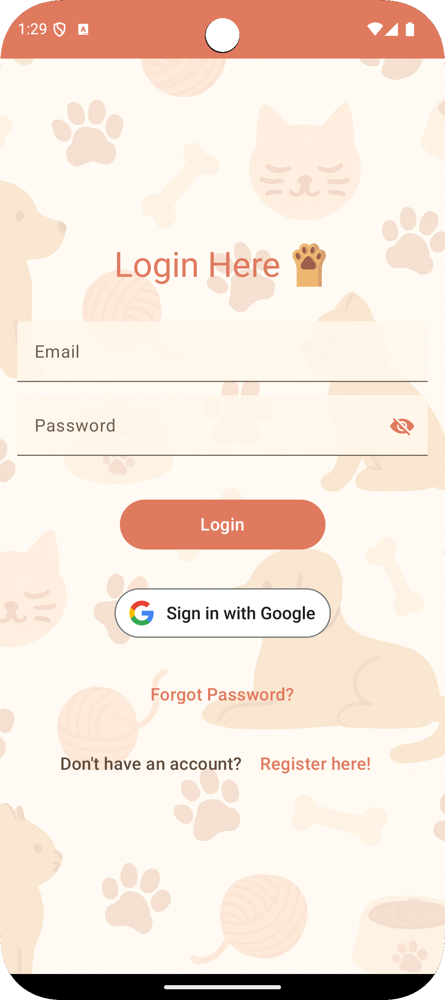</td>
<td>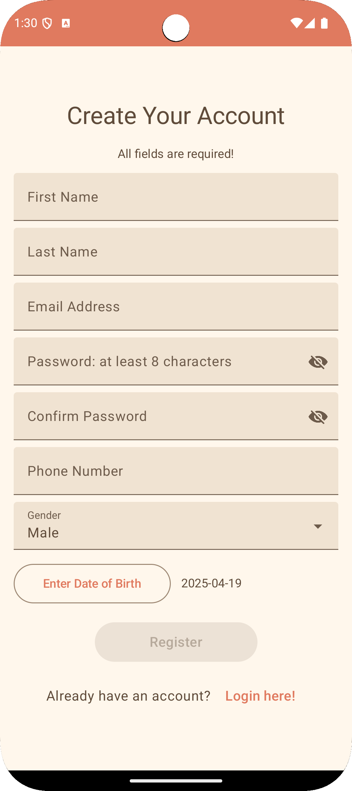</td>
</tr>
</table>

2. Setup pet profile by clicking "Add New Pet"
<table>
<tr>
<td>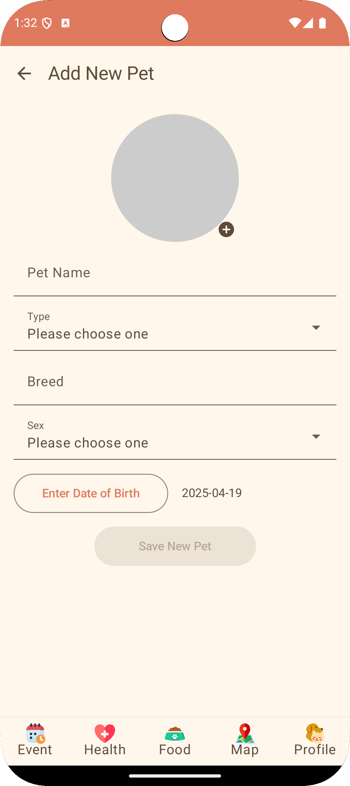</td>
<td>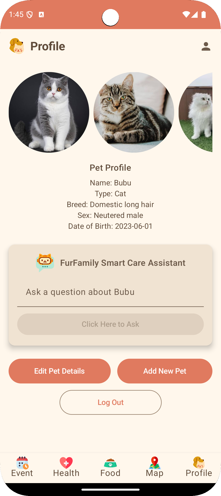</td>
</tr>
</table>

### 📅 Calendar & Events
- View and manage all pet-related events in one place
- Search events by keyword or filter feeding records by pet
- Integrate Google Calendar events (if use Google sign in)
<table>
<tr>
<td>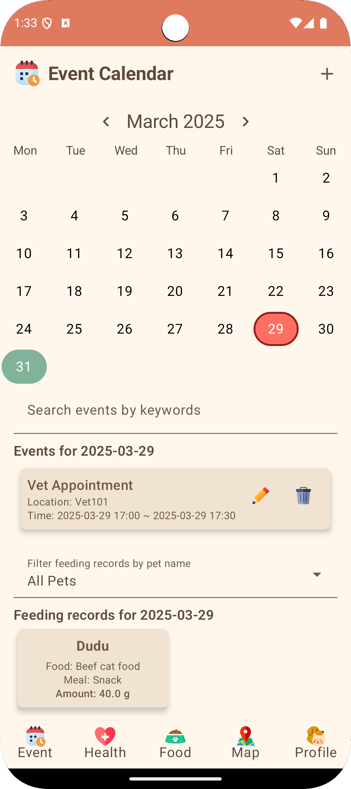</td>
<td>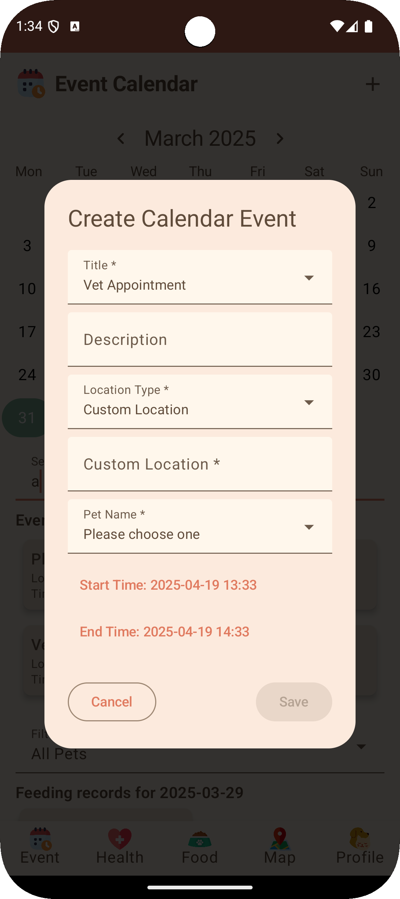</td>
<td>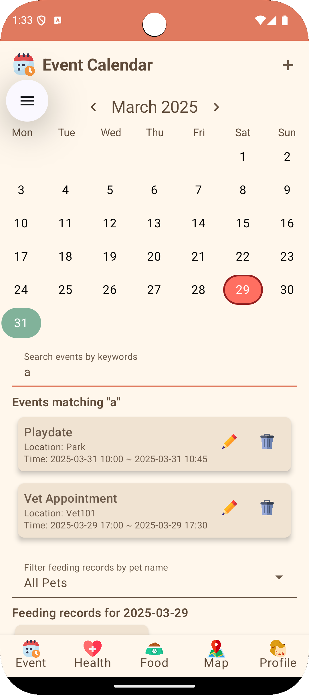</td>
</tr>
</table>

### 🏥 Health Dashboard
- Track daily calorie and water intake
- Monitor weight trends with interactive charts
- Generate and manage health reports for vet visits
<table>
<tr>
<td>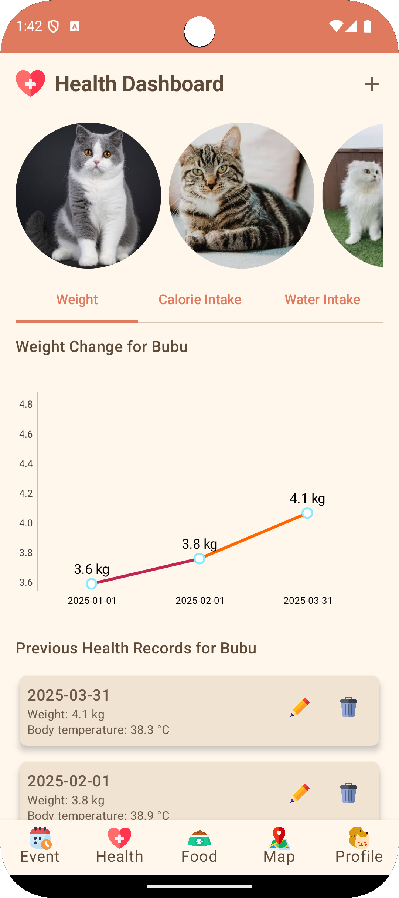</td>
<td>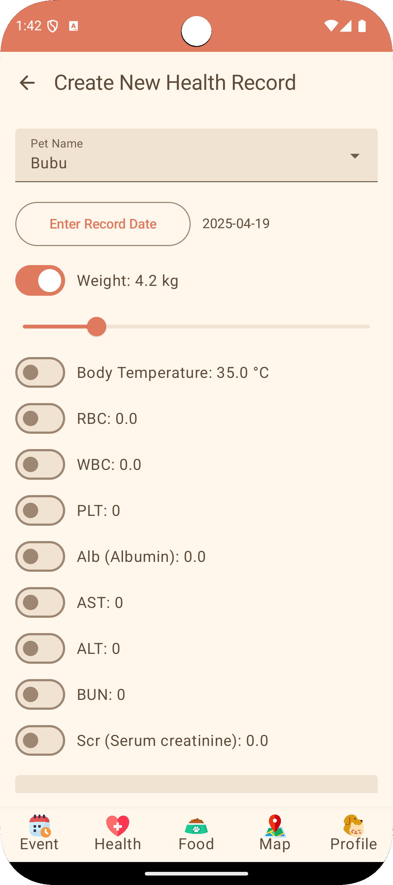</td>
</tr>
</table>

### 🍽️ Food & Feeding
- Scan food labels for nutritional information
- Set up feeding schedules
- Get portion recommendations based on pet's needs
- View and manage feeding records
<table>
<tr>
<td>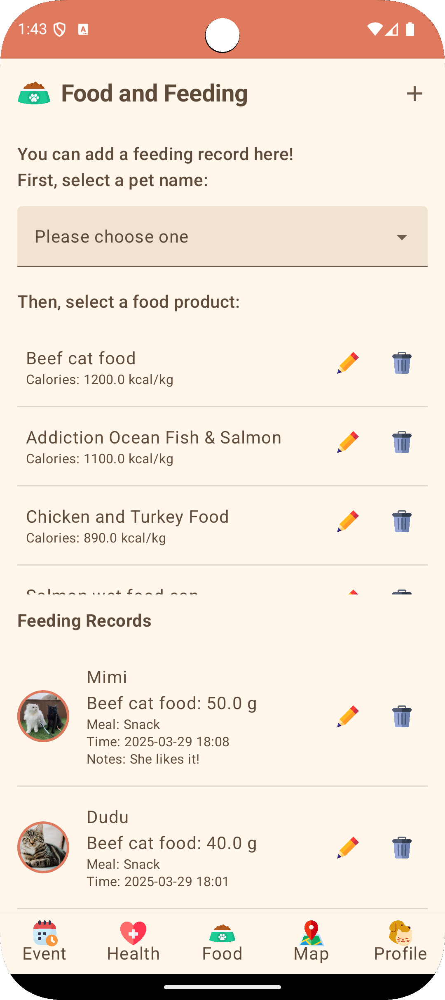</td>
<td>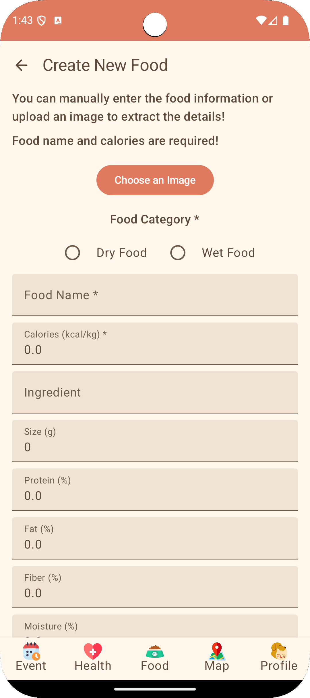</td>
<td>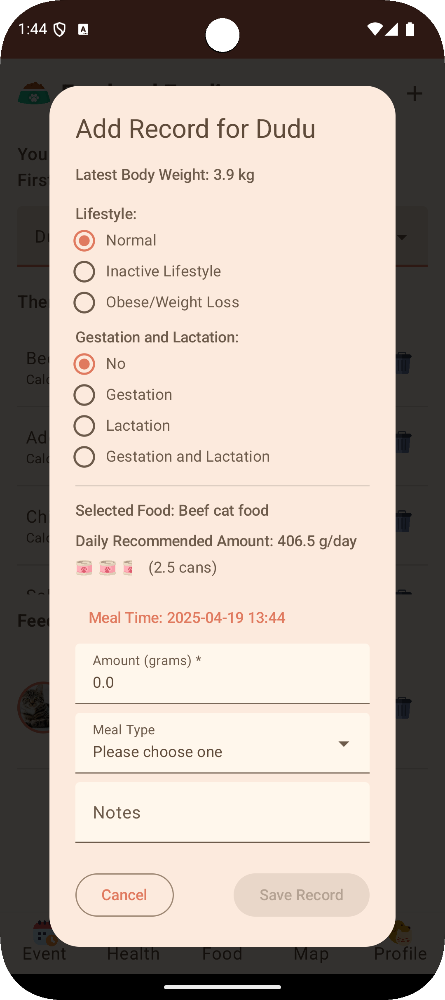</td>
</tr>
</table>

### 🗺️ Map & Location
- Find and navigate all kinds of pet services
- Save favorite locations with custom tags
- Filter services by category (vet, pet store, park, etc.)
<table>
<tr>
<td>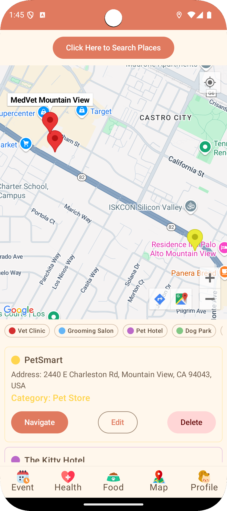</td>
<td>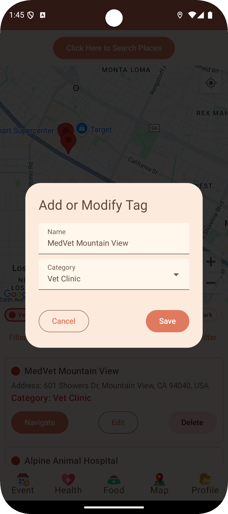</td>
</tr>
</table>

### 🤖 Profile & Smart Care Assistant
- Create and manage pet profile
- Get AI-powered care advice for each pet
- User basic info updates
<table>
<tr>
<td></td>
<td>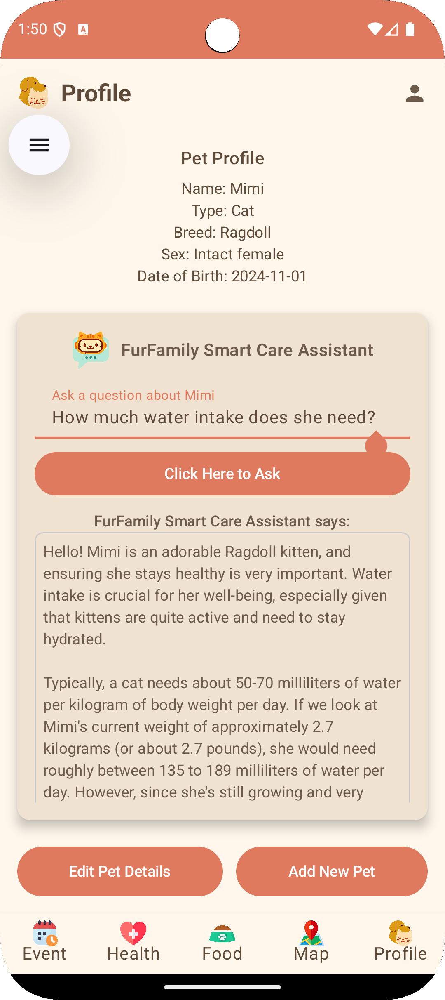</td>
</tr>
</table>

## 🛠 Tech Stack
- **Frontend**
  - Jetpack Compose for UI
  - Material Design 3 components
  - MPAndroidChart for data visualization
- **Backend**
  - Firebase Authentication
  - Firebase Realtime Database
  - Google Sign-In integration
- **Architecture**
  - MVVM (Model-View-ViewModel) pattern
  - Repository pattern
  - Dependency Injection with Hilt

## ✅ Prerequisites
- Android Studio Hedgehog | 2023.1.1 or later
- Android SDK 34 (Android 14)
- Kotlin 1.9.0 or later
- Gradle 8.0 or later

## 📦 Setup Instructions
1. **Clone the Repository**
   ```bash
   git clone https://github.com/alice856262/FurFamily.git
   ```
2. **Open in Android Studio**
   - Open Android Studio
   - Select "Open an existing project"
   - Navigate to the cloned repository and select it
3. **Configure Firebase**
   - Create a new Firebase project
   - Add the `google-services.json` file to the `app` directory
   - Enable Email/Password and Google Sign-In authentication methods
4. **Configure Google Sign-In**
   - Create a new project in the Google Cloud Console
   - Enable the Google Sign-In API
   - Add your SHA-1 fingerprint to the Firebase project
   - Update the `google-services.json` file
5. **Build and Run**
   - Sync the project with Gradle files
   - Connect an Android device or start an emulator
   - Click the "Run" button in Android Studio

## 📂 Project Structure
```
app/
└── src/
    └── main/
        ├── java/
        │   └── com.example.furfamily/           
        │       ├── calendar/         # Calendar and event management
        │       ├── health/           # Health tracking and analytics
        │       ├── nutrition/        # Food and feeding management
        │       ├── map/              # Map and location services
        │       ├── profile/          # Authentication and profile management
        │       ├── viewmodels/       # ViewModels for different features
        │       ├── di/               # Dependency injection
        │       └── Routes.kt         # Navigation routes
        └── res/
            └── drawable/             # Images and icons
```

## 🧱 Dependencies
```gradle
dependencies {
    // Core Android
    implementation 'androidx.core:core-ktx:1.12.0'
    implementation 'androidx.appcompat:appcompat:1.6.1'
    implementation 'com.google.android.material:material:1.11.0'
    
    // Compose
    implementation 'androidx.activity:activity-compose:1.8.2'
    implementation 'androidx.compose.ui:ui:1.6.1'
    implementation 'androidx.compose.material3:material3:1.2.0'
    
    // Firebase
    implementation platform('com.google.firebase:firebase-bom:32.7.1')
    implementation 'com.google.firebase:firebase-auth-ktx'
    implementation 'com.google.firebase:firebase-database-ktx'
    
    // Google Sign-In
    implementation 'com.google.android.gms:play-services-auth:20.7.0'
    
    // Charts
    implementation 'com.github.PhilJay:MPAndroidChart:v3.1.0'
    
    // Dependency Injection
    implementation 'com.google.dagger:hilt-android:2.48'
    kapt 'com.google.dagger:hilt-android-compiler:2.48'
}
```

---

Thank you for visiting the FurFamily project! Reach out for collaboration or inquiries! 🐶🐱